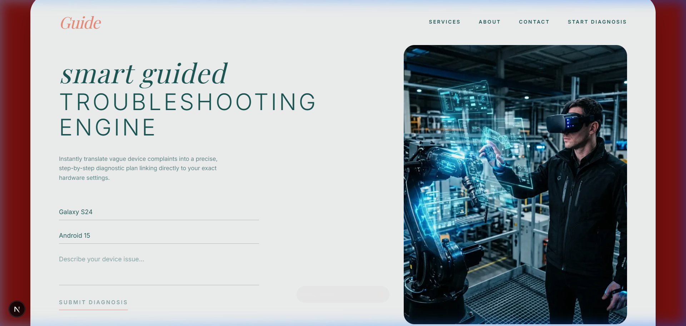
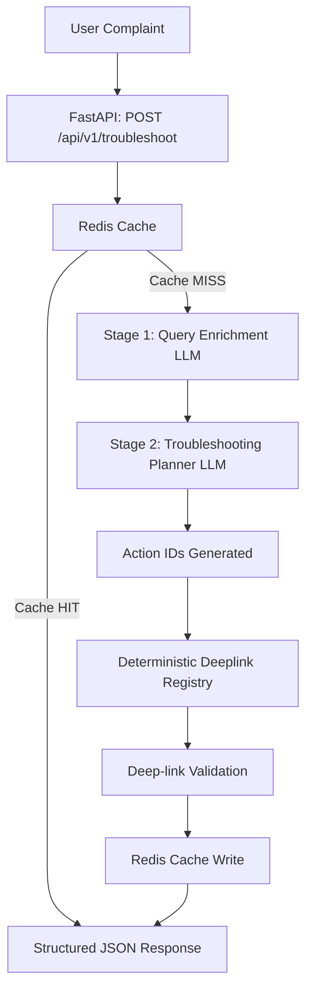

# GUIDE — Smart Guided Troubleshooting Engine



## 1. Problem
Vague customer complaints about device issues (e.g., "my screen flickers and battery dies fast") are difficult to map to precise technical solutions. Existing generic chatbots provide unstructured advice without deterministic, one-tap actions for the user to solve their issue.

## 2. Solution
**GUIDE** is a smart, structured troubleshooting engine that converts vague complaints into normalized technical intents, maps them to deterministic troubleshooting actions, and securely resolves device-specific deeplinks. It returns strict JSON payloads that render a guided, one-tap UI.

## 3. Key features
- **Two-stage LLM Architecture**: Query enrichment followed by structured action planning.
- **Deterministic Deeplink Registry**: Strictly maps abstract action IDs to verified OS-level intents.
- **Fast-path Caching**: Intercepts repeated queries directly from Redis without touching the LLM.
- **Strict JSON Contract**: Ensures the frontend always receives reliable, typed data.
- **Demo Mode UI**: Frontend can run in a static mocked state for UI review when backends are unavailable.

## 4. Architecture



## 5. Two-stage LLM pipeline
- **IMPLEMENTED:** 
  - Stage 1 normalizes the complaint into domains, symptoms, and severity.
  - Stage 2 outputs structured actions mapped to known action IDs.

## 6. Action/deeplink registry
- **IMPLEMENTED:** Resolves safe, deterministic actions via `services/deeplink_registry.py`. Currently uses mocked Android Settings intent mappings (e.g., `android.settings.DISPLAY_SETTINGS`).
- **PLANNED/FUTURE:** Verifying physical deep links against actual Samsung Galaxy hardware profiles and resolving dynamic variables.

## 7. Redis fast-path caching
- **IMPLEMENTED:** Deterministic cache keys bypass LLM processing for exact query matches.
- **PLANNED/FUTURE:** Advanced semantic similarity caching with Pinecone/Vector DB.

## 8. REST API
**Endpoint:** `POST /api/v1/troubleshoot`
Request:
```json
{
  "complaint": "my screen flickers and battery drains fast",
  "device_model": "Galaxy S24",
  "os_version": "Android 15"
}
```

## 9. JSON response example
*(Note: Example values. Latency and costs are illustrative.)*
```json
{
  "request_id": "req_123",
  "query": {
    "normalized_intents": ["rapid_battery_drain", "display_flickering"],
    "symptoms": ["battery_drain", "flicker"],
    "technical_domains": ["battery", "display"],
    "severity": "medium",
    "original_complaint": "my screen flickers and battery drains fast"
  },
  "device": { "model": "Galaxy S24", "os": "Android 15" },
  "actions": [
    {
      "action_id": "battery_settings",
      "priority": 1,
      "title": "Check battery settings",
      "rationale": "High battery drain investigation",
      "steps": [
        {
          "step": 1,
          "instruction": "Open Battery settings",
          "action_id": "battery_settings",
          "deeplink": "android.intent.action.POWER_USAGE_SUMMARY",
          "deeplink_valid": true
        }
      ]
    }
  ],
  "metadata": {
    "cache_hit": false,
    "latency_ms": 1450.0,
    "estimated_cost_usd": 0.015,
    "validation": "passed"
  }
}
```

## 10. Project structure
```text
src/
  chatbot_ai_system/
    api/              # FastAPI routers
    orchestration/    # 2-Stage Troubleshooter
    schemas/          # Pydantic JSON contracts
    services/         # Deeplink registry
    providers/        # LLM integration
    cache/            # Redis / memory caching
tests/                # Integration and Smoke tests
frontend/             # Next.js React Application
```

## 11. Technology stack
- **Backend:** Python 3.12, FastAPI, Pydantic v2
- **Infrastructure:** Docker, Redis, PostgreSQL (via asyncpg)
- **Frontend:** Next.js 15, React, TailwindCSS

## 12. Local setup
Python 3.12 is the supported development version. Ensure you are using a compatible environment, or simply use Docker to abstract it.
```bash
git clone https://github.com/priyanshu150106/Guide---Smart-Guided-Troubleshooting-Engine.git
cd Guide---Smart-Guided-Troubleshooting-Engine
```

## 13. Docker setup
Docker is the primary reproducible environment (runs `python:3.12-slim`).
```bash
docker compose up -d backend redis postgres --build
```
*Note: Local execution of the backend could not be completed in the current development environment because Docker was unavailable and the local interpreter was Python 3.14.*

## 14. Environment variables
Create `.env`:
```bash
OPENAI_API_KEY=your_key_here
ANTHROPIC_API_KEY=your_key_here
```
For Frontend demo mode, create `frontend/.env.local`:
```bash
NEXT_PUBLIC_GUIDE_DEMO_MODE=true
```

## 15. Testing
Tests are implemented but not executed in the current environment due to missing compiler tools for Python 3.14 dependencies. 
To run (in a valid environment):
```bash
docker compose exec backend bash
poetry run pytest
```

## 16. Evaluation/metrics
- **IMPLEMENTED:** Latency and simple token estimation.
- **PLANNED/FUTURE:** Formal automated evaluation pipeline for Phase 2 accuracy.

## 17. Limitations
- Deeplinks currently target general Android intents rather than Samsung proprietary sub-activity links (pending physical hardware testing).
- Multi-tenancy and rate-limiting are included in the architecture but not strictly enforced for the hackathon prototype.

## 18. Future improvements
- Introduce physical hardware tests to map out obscure Samsung settings URIs.
- Enable semantic vector search for historical troubleshooting tickets.
- Add conversational follow-ups for diagnostic clarifications.
